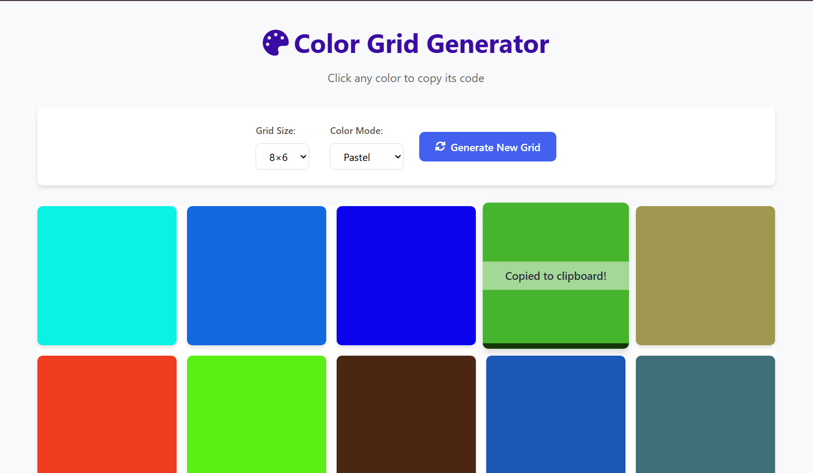

# Random Color Generator

A simple web application that generates a grid of random colors based on user-selected preferences. Click any color to copy its code to your clipboard.

## Features

- **Customizable Grid Size**: Choose from 5×4, 6×5, or 8×6 grid layouts
- **Multiple Color Modes**:
  - Random: Completely random hex colors
  - Pastel: Soft, light pastel colors
  - Dark: Deep, dark colors
  - Vibrant: Bright, saturated colors
- **One-click Copy**: Simply click any color to copy its code to clipboard
- **Visual Feedback**: Animation when color is copied

## Technologies Used

- HTML5
- CSS3
- JavaScript (ES6)
- Font Awesome for icons

## How to Use

1. Select your preferred grid size from the dropdown
2. Choose a color mode
3. Click "Generate New Grid" to create a new color grid
4. Click any color cell to copy its color code

## Installation

No installation required - just open `index.html` in any modern web browser.

## Future Improvements

- Add color code display (HEX, RGB, HSL) for selected colors
- Implement color scheme generation (complementary, analogous, etc.)
- Add save/export functionality
- Implement color favoriting system

## Screenshot

## License

MIT License - free to use and modify

---

Enjoy exploring colors! 🎨
